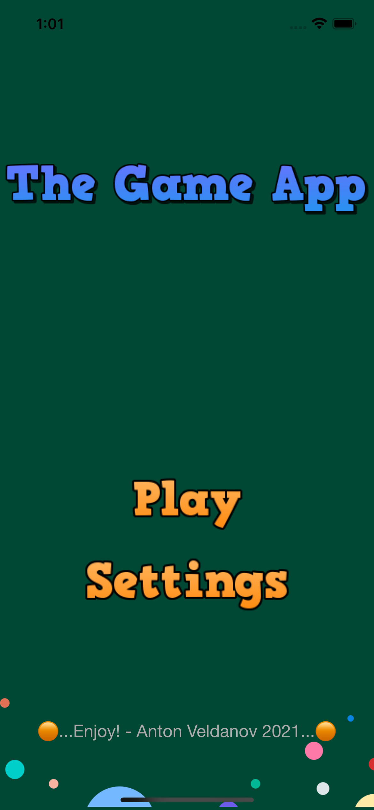
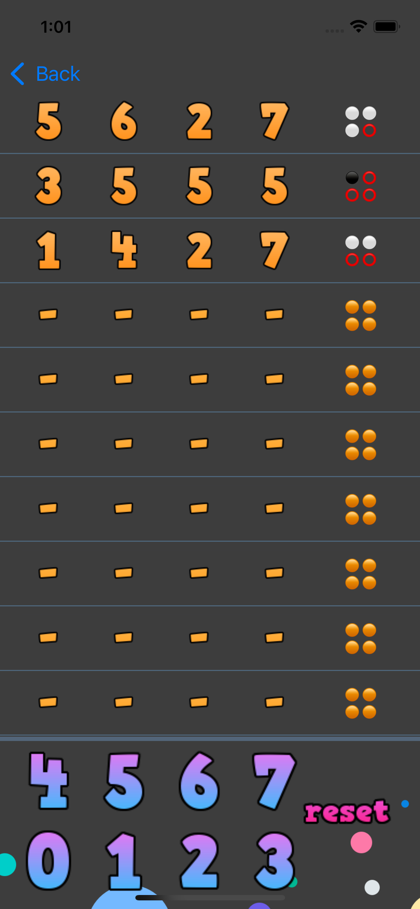
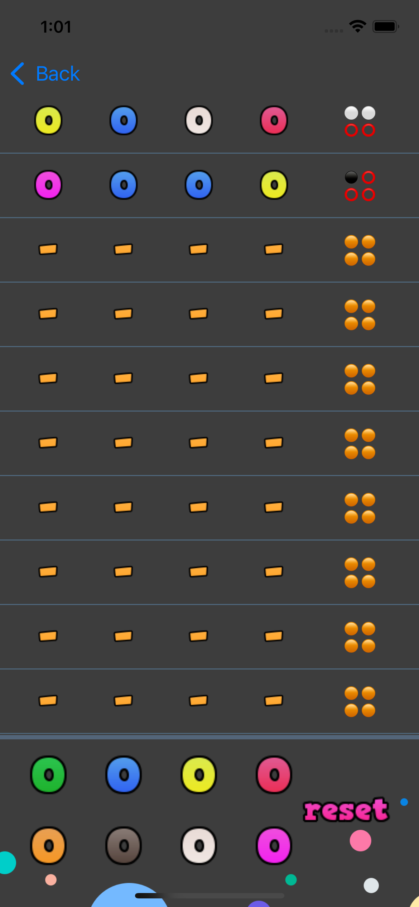
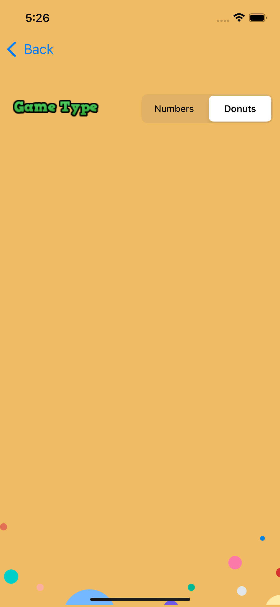

### System Requirements:
-    iOS – 15.1 or later
-    Mobile device model – iPhone 13 Pro Max
-    Xcode version – 13.1
-    Operation System – MacOS Catalina 11.6.1

### The goal

Implement a game, which can be played by a user "against" the computer.
This game where a player tries to guess the number combinations.
At the end of each attempt to guess the 4 number combinations, the computer will provide feedback whether the player had guessed a number correctly, or/and a number and digit correctly.
A player must guess the right number combinations within 10 attempts to win the game.

### What was created

Created an interactive game app with enabled random number generator API from `random.org.` The app has a graphic UI interface that allows to select numbers by clicking respective buttons. 
 
 
### Technologies used

-    `random.org` API to generate random numbers
-    Use of graphic tools to build visuals - Canva and Appicon
-    Delegate Pattern to transfer data between classes
-    Depenency Injectction to streamline UI testing
-    External library to animate the label textflow
-    Combined `tableView` views
-    MVVM model
-    Separated business logic from views
-    Data Persistance - UserDefaults 
-    Unit and UI testing

### How to clone and run the app

Head over to the provided URL and use it to clone the starting project in Xcode.
Once the link is clicked it will open a page of the public GitHub repository that hosts the project files. 
Then on the right side of the page click the green ‘click or download’ button. In the drop-down menu copy the link by pressing the ‘copy’ button. 
Go back to Xcode. If no projects are opened, by opening Xcode you’ll see the welcome screen with the ‘clone an existing project’ option. Otherwise, you can go to the source control menu then clone option. Both options get you to the same screen to paste the URL you copied over from GitHub. As soon as pasted, proceed to cloning and save the project on your computer. Once it's done cloning you should see the project opened. If not, navigate to the folder the project was safed in via Xcode and open it as a saved project

### Project creation key milestones

1.    Research - Familiarized with the task and options of implementation. 
2.    Created initial app flow using lucid chart
3.    Build a basic functionality in Xcode Playground
4.    Build User Interface in Xcode
5.    Created API Caller 
6.    Defined Design Pattern - MVVM
7.    Moved functionality into the UI view
8.    Enchanced text fly-in with CocoaPOD - CLTypingLabel
9.    Refactored code to access new Settings functionality
10.    Added the UI and Unit testing along with refactoring to dependency injection pattern
11.   Manual QA

### Next Steps

-    Automation testing
-    Deeper debugging / refactoring
-    Optional: link to a database to persist the state
-    Adding Legal statement
-    Deploying in AppStore

### How to play

The pattern combination of 4 numbers is automatically generated. A player should enter numbers 0 through 7 using graphic buttons at the bottom of the screen. Then make sure to click the Check button to get feedback from the game whether the number is guessed correctly.  There are two types of hints.
White dots show the number of digits guess but the position is not correct. The black dots show that the digit and its position is correctly guessed. The player will have 10 attempts to guess the number. 

### The Game App Screenshots

&nbsp

&nbsp

&nbsp

